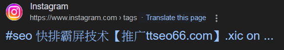

# TL;DR
這是一個uBlacklist訂閱清單，規則全部基於標題匹配，不定期更新

# Why?
這幾年來垃圾站點不斷進化，到現在已經可以寄生在正常網站，而現存的uBlacklist規則清單大多針對域名，對於這類網站完全無效

因此，利用網頁標題識別這類網站可能是比較好的做法，使用的關鍵字來自GPT-4o的中文token和自行爬取的google搜尋結果

目前規則分成以下幾類
1. advertisement: 廣告
2. gambling: 賭博
3. porn: 色情
4. others: 不知道要怎麼分類的，誤殺可能會比較多
5. manual_rules: 手工加入的規則
6. all_in_one: 以上全部

# 用法

# 推薦的其他清單
1. https://iorate.github.io/ublacklist/subscriptions#chinese
2. https://github.com/cobaltdisco/Google-Chinese-Results-Blocklist/tree/master
# TODO
- [ ] 繁簡轉換
- [ ] 自動爬取關鍵字
- [ ] 自動分詞
- [ ] 簡化列表，去除一些不必要的規則
